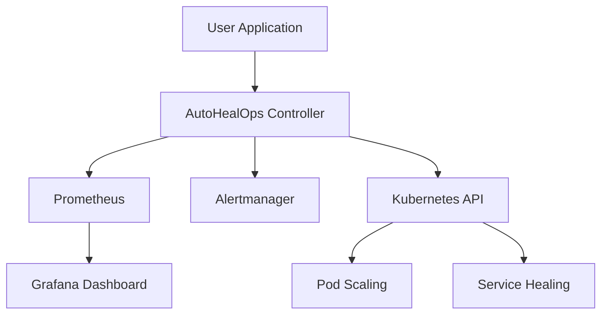

# AutoHealOps 🚀

[](https://github.com/your-repo/autohealops/actions)
[](LICENSE)
[](https://docker.com)
[](https://kubernetes.io)
[](https://nodejs.org)

> Production-grade self-healing DevOps platform built using Docker, Kubernetes, CI/CD, and monitoring tools. Automatically detects and heals application failures in real-time.

  
*Watch the platform in action - self-healing in progress!*

## 🌟 Features

- **Self-Healing Automation**: Automatically detects and resolves common application failures
- **Kubernetes Native**: Deployed as microservices on Kubernetes clusters
- **Monitoring Stack**: Integrated Prometheus, Grafana, and Alertmanager for comprehensive observability
- **CI/CD Ready**: Pre-configured pipelines for automated deployment
- **Docker Containerized**: Easy deployment and scaling with Docker containers
- **Horizontal Pod Autoscaling**: Automatically scales based on resource usage
- **Alert Rules**: Custom alert configurations for proactive monitoring

## 🏗️ Architecture




## 🚀 Quick Start

### Prerequisites

- Docker & Docker Compose
- Kubernetes cluster (minikube, EKS, AKS, etc.)
- kubectl configured
- Node.js 18+

### Installation

1. **Clone the repository**
   ```bash
   git clone https://github.com/your-repo/autohealops.git
   cd autohealops
   ```

2. **Build and run with Docker**
   ```bash
   cd docker
   docker build -t autohealops .
   docker run -p 3000:3000 autohealops
   ```

3. **Deploy to Kubernetes**
   ```bash
   kubectl apply -f k8s/
   kubectl get pods
   ```

4. **Access the application**
   - Application: http://localhost:3000
   - Grafana: http://localhost:3001
   - Prometheus: http://localhost:9090

## 📊 Monitoring Dashboard

Access the Grafana dashboard to visualize metrics and alerts:


## 🔧 Configuration

### Environment Variables

```bash
# Application
NODE_ENV=production
PORT=3000

# Monitoring
PROMETHEUS_URL=http://prometheus:9090
GRAFANA_URL=http://grafana:3001

# Kubernetes
KUBE_CONFIG_PATH=~/.kube/config
```

### Alert Rules

Customize alert rules in `k8s/alert-rules.yaml`:

```yaml
apiVersion: monitoring.coreos.com/v1
kind: PrometheusRule
metadata:
  name: autohealops-alerts
spec:
  groups:
  - name: autohealops
    rules:
    - alert: HighErrorRate
      expr: rate(http_requests_total{status=~"5.."}[5m]) > 0.1
      for: 5m
      labels:
        severity: critical
      annotations:
        summary: "High error rate detected"
        description: "Error rate is {{ $value }} errors per second"
```

## 🧪 Testing

Run the test suite:

```bash
npm test
```

Run integration tests with Kubernetes:

```bash
kubectl apply -f k8s/test-deployment.yaml
```

## 🤝 Contributing

1. Fork the repository
2. Create a feature branch (`git checkout -b feature/amazing-feature`)
3. Commit your changes (`git commit -m 'Add amazing feature'`)
4. Push to the branch (`git push origin feature/amazing-feature`)
5. Open a Pull Request

## 📝 License

This project is licensed under the MIT License - see the [LICENSE](LICENSE) file for details.

## 🙏 Acknowledgments

- [Kubernetes](https://kubernetes.io/) - Container orchestration
- [Prometheus](https://prometheus.io/) - Monitoring and alerting
- [Grafana](https://grafana.com/) - Visualization
- [Docker](https://docker.com/) - Containerization

---

Made with ❤️ by the kartheek
